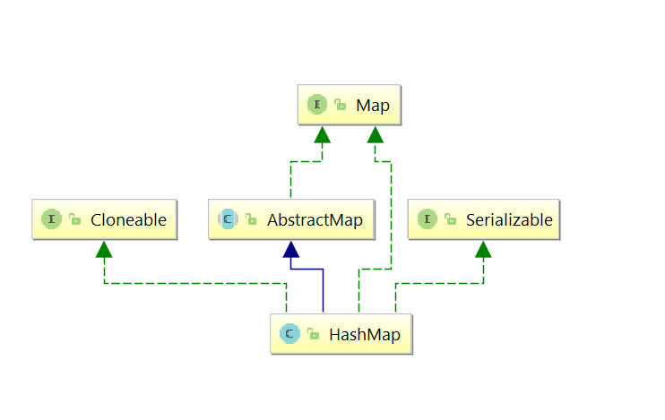

<h1>开门见山</h1>

**依赖**

**重要变量与概念**

.png)

（Entry在1.8中是Node）
1）其中，loadFactor75%的意思是当HashMap容器中元素数目占了容量的75%也就是threahold，就开始扩容。threshold=size*loadFactor。
2）size这个字段其实很好理解，就是HashMap中实际存在的键值对数量。注意和table的长度length、容纳最大键值对数量threshold的区别。而modCount字段主要用来记录HashMap内部结构发生变化的次数，主要用于迭代的快速失败。强调一点，内部结构发生变化指的是结构发生变化，例如put新键值对(区别HTTP的post为更新)，但是某个key对应的value值被覆盖不属于结构变化。

<h2>数据结构</h2>

Entry节点处理哈希冲突采用了链地址法的方式。
底层用到了：数组+链表+红黑树（链表太长时会自动转为红黑树，
时间会从O(n)降为O(logn)）

.png)

.png)

在Java8中，使用Node来代替Entry。Entry作为接口存在，并且Node实现了Entry。
1.8和1.7的最大区别就是多了转换红黑树这一块。
我们知道在Java中最常用的两种结构是数组和模拟指针(引用)，几乎所有的数据结构都可以利用这两种来组合实现。数组的存储方式在内存的地址是连续的，大小固定，一旦分配不能被其他引用占用。它的特点是查询快，时间复杂度是O(1)，插入和删除的操作比较慢，时间复杂度是O(n)，链表的存储方式是非连续的，大小不固定，特点与数组相反，插入和删除快，但查询速度慢。而HashMap既用到了数组也用到了引用，可以说是一种折中的方案吧。

<h1>混沌中的现形——构造方法</h1>

如果什么都没有指定，那会取默认值：默认的容量为16，默认的最大极限容量为1<<30，loadFactor为0.75。
其他所有方法都可以归结为这个方法：

    public HashMap( int initialCapacity, float loadFactor){
            if (initialCapacity < 0)
                throw new IllegalArgumentException("Illegal initial capacity: " +
                        initialCapacity);
            if (initialCapacity > MAXIMUM_CAPACITY)
                initialCapacity = MAXIMUM_CAPACITY;
            if (loadFactor <= 0 || Float.isNaN(loadFactor))
                throw new IllegalArgumentException("Illegal load factor: " +
                        loadFactor);
            this.loadFactor = loadFactor;
            this.threshold = tableSizeFor(initialCapacity);//看下面
        }
        
     //该方法就是找到比cap大的首个2的幂次方
     static final int tableSizeFor(int cap) {
        int n = cap - 1;
        n |= n >>> 1;//先无符号右移1位，再按位或
        n |= n >>> 2;
        n |= n >>> 4;
        n |= n >>> 8;
        n |= n >>> 16;
        return (n < 0) ? 1 : (n >= MAXIMUM_CAPACITY) ? MAXIMUM_CAPACITY : n + 1;
     }

但是我们并没有看到什么创建数组的过程，其实在put增加元素的时候才会动态创建，用的是Node<K,V>[],具体代码看下面的putVal(...)方法。
<h1>对HashMap操作</h1>

<h2>定位索引</h2>

     方法一：
        static final int hash(Object key) {   //jdk1.8 & jdk1.7
            int h;
            // h = key.hashCode() 为第一步 取hashCode值
            // h ^ (h >>> 16)  为第二步 高位参与运算
            return (key == null) ? 0 : (h = key.hashCode()) ^ (h >>> 16);
        }
        方法二：
        static int indexFor(int h, int length) {  //jdk1.7的源码，jdk1.8没有这个方法，但是实现原理一样的
            return h & (length-1);  //第三步 取模运算
        }
对于任意给定的对象，只要它的hashCode()返回值相同，那么程序调用方法一所计算得到的Hash码值总是相同的。我们首先想到的就是把hash值对数组长度取模运算，这样一来，元素的分布相对来说是比较均匀的。但是，模运算的消耗还是比较大的，在HashMap中是这样做的：调用方法二来计算该对象应该保存在table数组的哪个索引处。
这个方法非常巧妙，它通过h & (table.length -1)来得到该对象的保存位，而HashMap底层数组的长度总是2的n次方，这是HashMap在速度上的优化。当length总是2的n次方时，h& (length-1)运算等价于对length取模（&后的结果总是比length-1要小），也就是h%length，但是&比%具有更高的效率。
在JDK1.8的实现中，优化了高位运算的算法，通过hashCode()的高16位异或低16位实现的：(h = k.hashCode()) ^ (h >>> 16)，主要是从速度、功效、质量来考虑的，这么做可以在数组table的length比较小的时候，也能保证考虑到高低Bit都参与到Hash的计算中，同时不会有太大的开销。

<h2>put操作</h2>

.png)

上面创造了HashMap之后，按操作顺序来，我们来看下put操作，所有的put操作都会到下面这个方法来：

     final V putVal ( int hash, K key, V value,boolean onlyIfAbsent,
        boolean evict){
            Node<K, V>[] tab;
            Node<K, V> p;
            int n, i;
            if ((tab = table) == null || (n = tab.length) == 0)//此处tab=table即创建了HashMap
                n = (tab = resize()).length;
            if ((p = tab[i = (n - 1) & hash]) == null)//若该位置为空
                tab[i] = newNode(hash, key, value, null);
            else {
                Node<K, V> e;
                K k;
                if (p.hash == hash &&
                        ((k = p.key) == key || (key != null && key.equals(k))))
                    e = p;//节点key存在，直接覆盖（看if退出后的代码）
                else if (p instanceof TreeNode)//节点为红黑树节点
                    e = ((TreeNode<K, V>) p).putTreeVal(this, tab, hash, key, value);
                else {//为链表
                    for (int binCount = 0; ; ++binCount) {//由break引导退出
        //如果p为尾节点，在尾节点创建Node后退出，退出后e=null
                        if ((e = p.next) == null) {
                            p.next = newNode(hash, key, value, null);
                            if (binCount >= TREEIFY_THRESHOLD - 1)
                                treeifyBin(tab, hash);//转成红黑树
                            break;
                        }
                        //如果链表中的节点key等于所给key值，直接退出
                        if (e.hash == hash &&
                                ((k = e.key) == key || (key != null && key.equals(k))))
                            break;
                        p = e;//p每次都会更新，一直往链表末尾方向移动
                    }
                }
                if (e != null) { // existing mapping for key
                    V oldValue = e.value;
                    //相同key的条件下，覆盖掉原来的value
                    if (!onlyIfAbsent || oldValue == null)
                        e.value = value;
                    afterNodeAccess(e);
                    return oldValue;
                }
            }
            ++modCount;
            if (++size > threshold)
                resize();
            afterNodeInsertion(evict);
            return null;
        }
       
<h2>扩容</h2>
下面是扩容的代码：

       final Node<K, V>[] resize () {
            Node<K, V>[] oldTab = table;
            int oldCap = (oldTab == null) ? 0 : oldTab.length;
            int oldThr = threshold;
            int newCap, newThr = 0;
            if (oldCap > 0) {
                if (oldCap >= MAXIMUM_CAPACITY) {
                    threshold = Integer.MAX_VALUE;
                    return oldTab;
                } else if ((newCap = oldCap << 1) < MAXIMUM_CAPACITY &&
                        oldCap >= DEFAULT_INITIAL_CAPACITY)
                    newThr = oldThr << 1; // double threshold
            } else if (oldThr > 0) // 这种情况发生在运行过程中hashmap被清空时
                newCap = oldThr;
            else { //capacity和threshold初始都为空，都取默认值
                newCap = DEFAULT_INITIAL_CAPACITY;
                newThr = (int) (DEFAULT_LOAD_FACTOR * DEFAULT_INITIAL_CAPACITY);
            }
            if (newThr == 0) {
                float ft = (float) newCap * loadFactor;
                newThr = (newCap < MAXIMUM_CAPACITY && ft < (float) MAXIMUM_CAPACITY ?
                        (int) ft : Integer.MAX_VALUE);
            }
            threshold = newThr;
            @SuppressWarnings({"rawtypes", "unchecked"})
            Node<K, V>[] newTab = (Node<K, V>[]) new Node[newCap];
            table = newTab;
            if (oldTab != null) {//覆盖元素到新数组
                for (int j = 0; j < oldCap; ++j) {
                    Node<K, V> e;
                    if ((e = oldTab[j]) != null) {
                        oldTab[j] = null;
                        if (e.next == null)
                            newTab[e.hash & (newCap - 1)] = e;
                        else if (e instanceof TreeNode)
                            ((TreeNode<K, V>) e).split(this, newTab, j, oldCap);
                        else { // preserve order
                            Node<K, V> loHead = null, loTail = null;
                            Node<K, V> hiHead = null, hiTail = null;
                            Node<K, V> next;
                            do {
                                next = e.next;
                                if ((e.hash & oldCap) == 0) {
                                    if (loTail == null)
                                        loHead = e;
                                    else
                                        loTail.next = e;
                                    loTail = e;
                                } else {
                                    if (hiTail == null)
                                        hiHead = e;
                                    else
                                        hiTail.next = e;
                                    hiTail = e;
                                }
                            } while ((e = next) != null);
                            if (loTail != null) {
                                loTail.next = null;
                                newTab[j] = loHead;
                            }
                            if (hiTail != null) {
                                hiTail.next = null;
                                newTab[j + oldCap] = hiHead;
                            }
                        }
                    }
                }
            }
            return newTab;
        }
  
<h2>删除</h2>        
删除节点比较简单，都会走下面的方法，无非是分为两步：第一步找到要删除的节点；第二步删除节点并调整hashmap。
             
        final Node<K, V> removeNode ( int hash, Object key, Object value,
            boolean matchValue, boolean movable){
                Node<K, V>[] tab;
                Node<K, V> p;
                int n, index;
                if ((tab = table) != null && (n = tab.length) > 0 &&
                        (p = tab[index = (n - 1) & hash]) != null) {//hashmap必须不为空
                    Node<K, V> node = null, e;
                    K k;
                    V v;
                    if (p.hash == hash &&
                            ((k = p.key) == key || (key != null && key.equals(k))))
                        node = p;//如果头节点为要删的节点
                    else if ((e = p.next) != null) {//否则往链表后走
                        if (p instanceof TreeNode)//如果是红黑树节点
                            node = ((TreeNode<K, V>) p).getTreeNode(hash, key);
                        else {//链表节点，往链表后面一直走，知道找到目标节点
                            do {
                                if (e.hash == hash &&
                                        ((k = e.key) == key ||
                                                (key != null && key.equals(k)))) {
                                    node = e;
                                    break;
                                }
                                p = e;
                            } while ((e = e.next) != null);
                        }
                    }
                    //找到目标节点后删除节点
                    if (node != null && (!matchValue || (v = node.value) == value ||
                            (value != null && value.equals(v)))) {
                        if (node instanceof TreeNode)
                            ((TreeNode<K, V>) node).removeTreeNode(this, tab, movable);
                        else if (node == p)//node是头节点
                            tab[index] = node.next;
                        else//node不是头节点
                            p.next = node.next;
                        ++modCount;
                        --size;
                        afterNodeRemoval(node);
                        return node;
                    }
                }
                return null;
            }
      
<h3>更新</h3>

       @Override
            public V replace (K key, V value){
                Node<K, V> e;
                if ((e = getNode(hash(key), key)) != null) {//找到对应的节点
                    V oldValue = e.value;
                    e.value = value;
                    afterNodeAccess(e);
                    return oldValue;
                }
                return null;
            }
    
            下面是找节点的代码：
            final Node<K, V> getNode ( int hash, Object key){
                Node<K, V>[] tab;
                Node<K, V> first, e;
                int n;
                K k;
                if ((tab = table) != null && (n = tab.length) > 0 &&
                        (first = tab[(n - 1) & hash]) != null) {//前提参数不为空
                    if (first.hash == hash && // 一定要检查是否为头节点
                            ((k = first.key) == key || (key != null && key.equals(k))))
                        return first;
                    if ((e = first.next) != null) {//非头节点分别判断红黑树节点和链表节点
                        if (first instanceof TreeNode)
                            return ((TreeNode<K, V>) first).getTreeNode(hash, key);
                        do {
                            if (e.hash == hash &&
                                    ((k = e.key) == key || (key != null && key.equals(k))))
                                return e;
                        } while ((e = e.next) != null);
                    }
                }
                return null;
            }
            
<h2>查</h2>
    
     public V get(Object key) {
               Node<K,V> e;
               return (e = getNode(hash(key), key)) == null ? null : e.value;
           }
查也用到了上面的getNode(...)方法。

<h1>安全性</h1>

HashMap不是线程安全的！多线程环境下：
1）使用Hashmap进行put操作会引起死循环，是因为多线程会导致HashMap的Node链表形成环状数据结构，查找时会陷入死循环，导致CPU利用率接近100%，所以在并发情况下不能使用HashMap。
2）put操作可能导致元素丢失。
                                                                