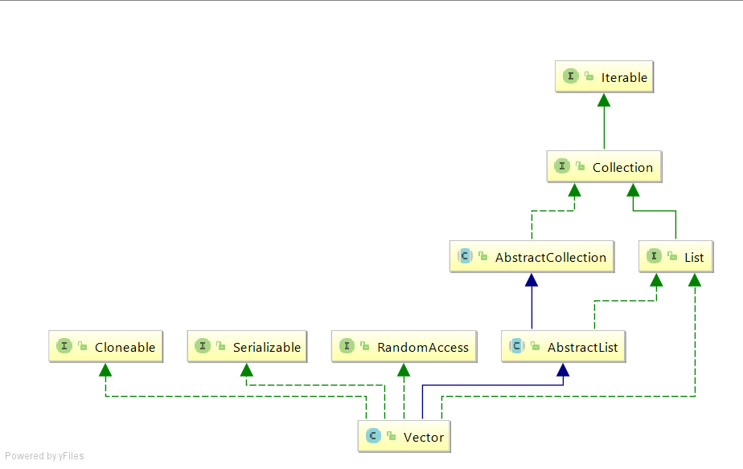

# Vector类

<h2>开门见山</h2>

下图是Vector类的依赖，Vector和List等都是集合类中的容器类，既然属于集合类，那就肯定拥有集合类的普遍功能，比如存储，增删改查。但也避免不了和其它集合类一样的问题，包括容器扩容，多线程操作安全以及与其它容器类的活生生的性能对比。而以上的种种，尽在Vector的源码中，下面我们幽径通幽：

<h2>混沌中的现形——构造方法</h2>

    public Vector(int initialCapacity, int capacityIncrement) {                  
        super();
        if (initialCapacity < 0)//参数负值校验
            throw new IllegalArgumentException("Illegal Capacity: " +
                    initialCapacity);
        this.elementData = new Object[initialCapacity];//创建容器
        this.capacityIncrement = capacityIncrement;
    }
    
之所以我们只看这个构造方法，是因为其它所有构造器到头来都是调用的这个构造方法。Vector初始化会创建一个指定大小的Object对象数组，如果不传入初始化大小那默认为10，不传入扩容步长则默认为0。
除了初始化，还可以通过setSize(int newSize)重新设置容量大小。
正因为是Object超类数组，所以Vector可以存储任意类型的元素，也可以存储重复的元素，而且元素也都是有序的。那有人要问，可不可以用泛型来指定存储元素的类型呢？答案是可以的，比如Vector<Integer> v=new Vector(3);
这时你存入数据就只能存入Integer类型的数据，否则编译器会报错。
而扩容参数capacityIncrement只是赋值给全局变量做个标记，这有点像懒加载的味道，也就是说只有在当前进行add的操作会导致容量溢出时才会使用到capacityIncrement，这种设计让构造Vector的时候节省了不少力气，这种全局标记也方便被使用。

<h2>容器的操作</h2>
有意思的东西来了，对操作而言，所有的写操作方法都被加上了synchronized悲观锁，保证每次在Vector增、删、改节点的时候，通过悲观锁来保证同步。因此Vector是线程安全的！（这个只能靠背）。
此外在对Vector元素操作的方法中，有些方法是重复的，区别只是有无返回值，这应该也是为了应对不同的情形吧。
<h3>增</h3>
add（...）类型的方法，不仅可以往数组最后加一个数据，也可以加多个数据，还指定位置插入数据，Vector所有的增操作都是思路都是一致的：
1）对于没指定插入位置的调用，默认往数组当前已有元素的最后一个后面插入。当然插入前一定要判断容量是否将溢出问题。
2）对于指定位置插入数据会繁琐一点，首先要将指定位置以及往后的数据都向右挪，挪的距离等于要插入的数据的大小，然后再把要插入的数据插入到中间的空隙中。其中elementCount这个变量用了很多次，表示的是当前Vector中已有元素的个数，不是Vector的容量大小，区别好！

     private void grow(int minCapacity) {
            // 对数组溢出非常敏感的逻辑
            int oldCapacity = elementData.length;
            int newCapacity = oldCapacity + ((capacityIncrement > 0) ?
                    capacityIncrement : oldCapacity);
            if (newCapacity - minCapacity < 0)
                newCapacity = minCapacity;
            if (newCapacity - MAX_ARRAY_SIZE > 0)
                newCapacity = hugeCapacity(minCapacity);
            elementData = Arrays.copyOf(elementData, newCapacity);
        }
        
在移动数据的过程中，调用
public static void arraycopy(Object src, int srcPos, Object dest, int destPos, int length)的作用是将一个数组中的内容复制到另外一个数组中。
相应参数了解会用即可：

- Object src : 原数组
- int srcPos : 从元数据的起始位置开始
- Object dest : 目标数组
- int destPos : 目标数组的开始起始位置
- int length  : 要copy的数组的长度

在每次往Vector加数据前都会判断是否将导致容量溢出，如果会就调用下面的扩容方法实现扩容，注意，只有增操作可以触发扩容。

    private void grow(int minCapacity) {
        // 对数组溢出非常敏感的逻辑
        int oldCapacity = elementData.length;//Vector容量
        int newCapacity = oldCapacity + ((capacityIncrement > 0) ?
                capacityIncrement : oldCapacity);
        if (newCapacity - minCapacity < 0)
            newCapacity = minCapacity;
        if (newCapacity - MAX_ARRAY_SIZE > 0)
            newCapacity = hugeCapacity(minCapacity);
        elementData = Arrays.copyOf(elementData, newCapacity);
    }
    
扩容之后，指定下一个索引值为指定数据值即可。
注意：
1）每个容器都是有容量极限的，Vector存储毫不例外。如下，Vector最大容量是整型整数的最大值-8，大概42亿。那为什么减8呢？原因是有些虚拟机会在编译时往Vector数组所在内存空间的前面加上一个字节头部信息，所以要减去8以作兼容避免内存溢出。
private static final int MAX_ARRAY_SIZE = Integer.MAX_VALUE - 8;
2）另外，在取的时候一定要注意
if (index >= elementCount)
    throw new ArrayIndexOutOfBoundsException(index);
的限制，不能取没有存放元素的下标

<h3>删</h3>
删除元素可以使用和增加相类似的思路，找到要删元素的位置后，将其往后的数据全部往前挪即可。

    public synchronized E remove(int index) {
        modCount++;
        if (index >= elementCount)
            throw new ArrayIndexOutOfBoundsException(index);
        E oldValue = elementData(index);

        int numMoved = elementCount - index - 1;
        if (numMoved > 0)
            System.arraycopy(elementData, index+1, elementData, index,
                    numMoved);
        elementData[--elementCount] = null; //GC处理

        return oldValue;
    }

如果要删除整个Vector中所有元素，可以使用一个很彻底的删除方法clear()。
<h3>改</h3>
修改十分方便，只需要对制定位置的元素替换掉即可，方法为set(int index,E element)，主要逻辑为：elementData[index] = element;
<h3>查</h3>
查数据在Vector中表现更多的是一种技巧和灵活性，这也是容器类的特点。为了应对多样苛刻的查询需求，Vector相应提供了多种方便的查询方法，比如查第一个元素（firstElement()），最后一个元素（lastElement()）以及更为通用的查对应位置的元素（get(int index)）。Vector还有一种容器常用的查方式——判断是否存在该元素，提供了诸如contains()和containsAll(...)的方法。另外，还有一种遍历查询，通过使用Iterator的方式来遍历容器中的所有元素，提供了iterator()等方法，而contains（）就是使用到了Iterator遍历器。而在Vector中使用了一个自定义的迭代器类VectorSpliterator，用来进行并行迭代查询。
除了查元素的各种方法，还可以查元素对应的下标：indexOf(....), lastIndexOf(...)等等，多了去了。
另外，Vector就跟ArrayList一样，查询比增加、删除要快一些。因为增删要移动位置，查找直接O（1）的时间复杂度。
<h3>容器体操作</h3>
增删改查提供了针对容器元素的操作，而Vector还提供了针对容器本身的多种灵活操作，而且因为Vector继承和实现了众多的三方类和接口，其本身也获得了相应的额外能力，这些功能都以方法的形式暴露出来提供调用。
最常见的就是查Vector容量大小的size()，将容器转为数组并输出的toArray()，容器是否为空的判断isEmpty()，去掉没元素的空间以便缩减容量trimToSize()，返回指定区间的元素subList(...)等。当然还有继承来的hashCode()，clone()，toString()等。至于其他的父类方法，自然也都是绿灯直接调用的。

这里要注意一个点：之前我们说过Vector本身就是Object数组，那为什么还要提供toArray()方法呢？其实你可以尝试用和数组一样的方式取元素，比如vector[index]，你会发现编译都编译不过，为什么呢？原来，Vector类的数组变量protected Object[] elementData;的修饰符是protected，意味着该数组最开放也只能开放到子包，更别说自己写的类要去调用了，也可以看作Vector的数组变量对外封闭起来了，所谓关了扇门，开了天窗，Vector绕了个路通过toArray()方法对外暴露一个复制出来的数组，这也是一种安全考虑的设计，毕竟可不能随意让调用者直接拿到原始数组，不然轻易的改动即可导致Vector的逻辑崩坏。

